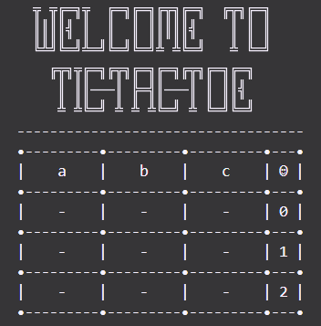

# Tictactoe

_By: Nami Eskandarian_

A simple Tic-Tac-Toe game with cool ASCII art created in Elixir!
Playable in the console, two players will take turns picking spaces to put 'x' or 'o' until a winner has been chosen or the game is a draw.

<p align="center">
  
</p>

## Installation

If [available in Hex](https://hex.pm/docs/publish), the package can be installed
by adding `tictactoe` to your list of dependencies in `mix.exs`:

```elixir
def deps do
  [
    {:tictactoe, "~> 0.1.0"}
  ]
end
```

Documentation can be generated with [ExDoc](https://github.com/elixir-lang/ex_doc)
and published on [HexDocs](https://hexdocs.pm). Once published, the docs can
be found at <https://hexdocs.pm/tictactoe>.
